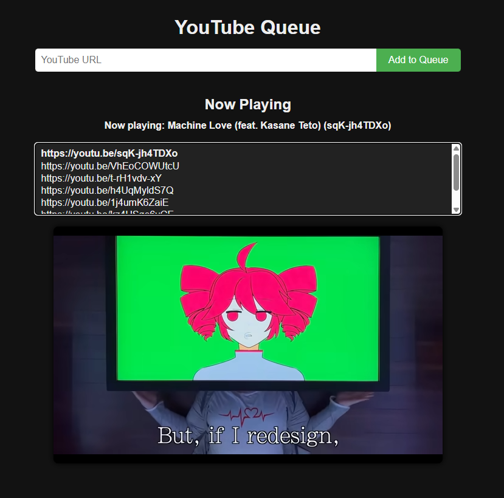
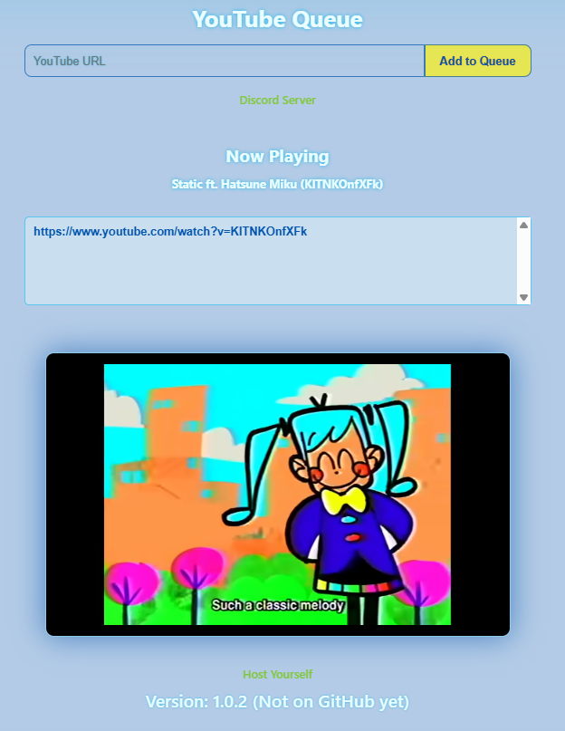
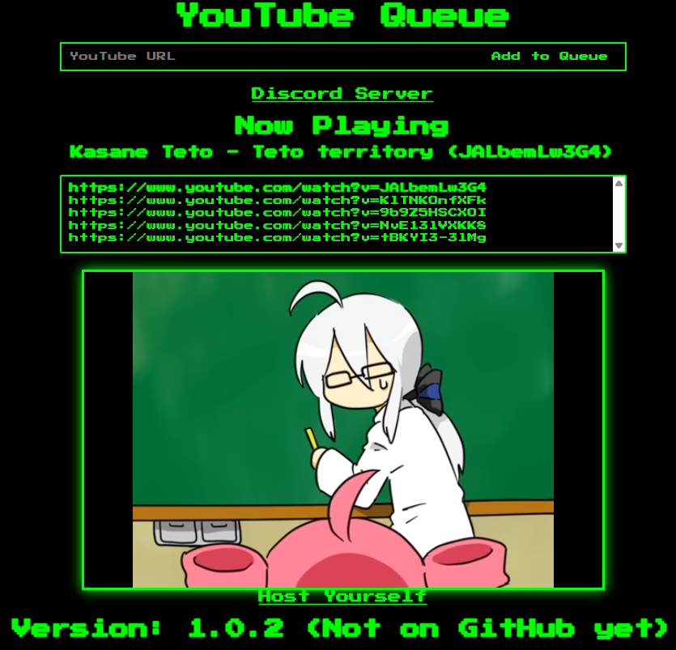
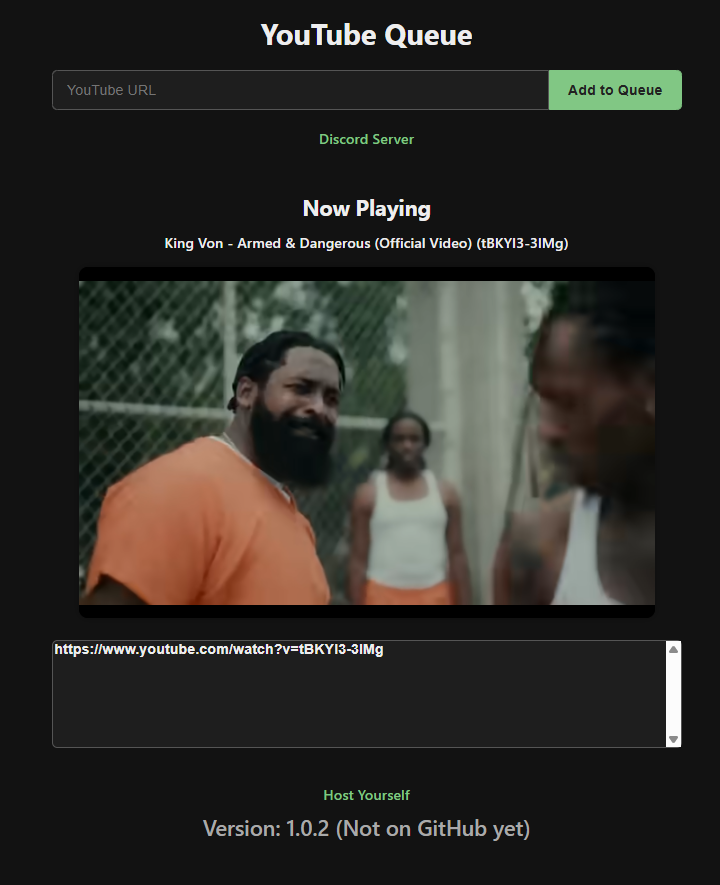
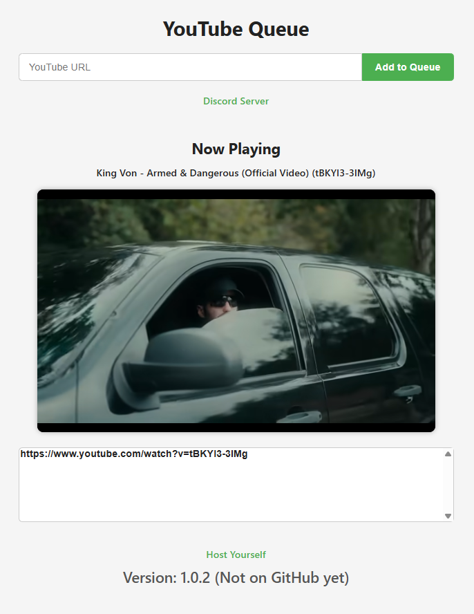

# sharedyoutube
Open-Source Python code that lets anyone to add youtube links to a queue


# How to use
Step 1.

Install everything you need
```pip install flask```

Step 2.

Modify the port if you wont run it as admin

Step 3.

Run it normally.

```python SharedYoutube.py```

Step 4.

Go crazy.

# Themes (Coming in 1.0.2)

Aero:


Retro:


Main:


Minimal (Dark / White):


